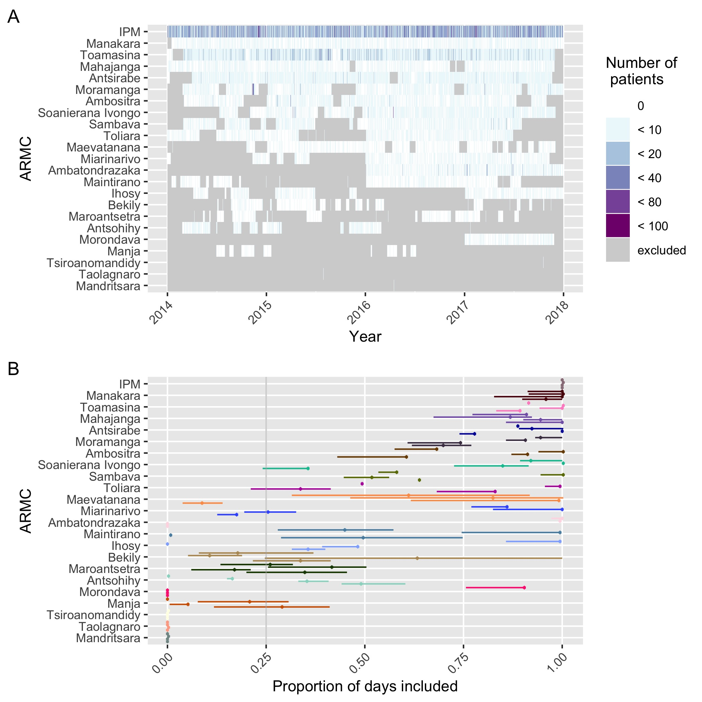

Supplementary Materials
================

## S1. Estimating travel times to the nearest ARMC

We used two raster inputs: 1) the travel time estimates generated using
the friction surface from the Malaria Atlas Project (REF) at an ~1 km^2
scale and the locations of existing ARMC and 2) the population estimates
which we resampled from the World Pop raster of population originally at
an N resolution. We then extracted the mean of travel times weighted by
the population in that grid cell for each district or commune to get
administrative level estimates of travel times to the nearest ARMC.
Figure S1 shows the raster inputs as well as the resulting estimates of
travel times at the admin
level.

``` r
library(here)
```

    ## here() starts at /Users/mrajeev/Documents/Projects/MadaAccess

``` r

```

<!-- -->

## S2. Correcting data for underreporting and excluding Category I exposures

### Underreporting of forms

Figure S1.1 correcting

Figure S1.2 vial ests

### Cat I exposures

Figure S1.3 contacts

Figure S1.4 ttime
differences

## S3. Candidate models of bite incidence

## S4. Sensitivity of these models to reporting/contact cut\_offs

## S5. Incrementally adding clinics (where they were added, shifts in ttimes + catchment pops, shifts in burden/reporting etc. –answer q here: why are there still abt 100 deaths)

## S6. Sensitivity of burden estimates to parameter assumptions (baseline + incremental)
